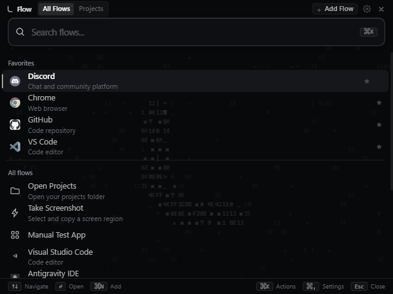

# Exist Flow

> Everything, one shortcut away.



Exist Flow is a fast, keyboard-first command launcher and workspace manager for Windows that eliminates context switching and desktop clutter by summoning applications, files, URLs, projects, and screen capture in an instant OLED-dark interface.

---

## Kurulum / Installation

Exist Flow Windows için iki farklı dağıtım biçiminde sunulur:

1. **NSIS Installer (`Exist Flow Setup 0.1.0.exe`)**:
   - Kurulum sihirbazı ile yükleme konumu seçilebilir (`allowToChangeInstallationDirectory: true`).
   - Masaüstü ve Başlat Menüsü kısayollarını otomatik olarak oluşturur.
   - Denetim Masası / Ayarlar üzerinden temiz bir şekilde kaldırılabilir.
2. **Portable Executable (`Exist Flow 0.1.0.exe`)**:
   - Kurulum gerektirmez; USB bellekten veya doğrudan indirilen klasörden tek tıkla çalıştırılabilir.
   - Yapılandırma verilerini yerel kullanıcı profilinde (`%APPDATA%\exist-flow`) depolar.

---

## Kısayollar / Keyboard Shortcuts

Exist Flow tamamen klavye odaklı çalışmak üzere tasarlanmıştır:

| Kısayol | İşlev / Açıklama | Kapsam |
| :--- | :--- | :--- |
| `Ctrl + Space` | **Launcher Aç / Kapat** (Her açılışta imlecin bulunduğu ekranın merkezinde açılır) | Global (Sistem geneli) |
| `Ctrl + Alt + D` | **Örnek Proje Kısayolu** (Doğrudan atanmış projeyi / çalışma alanını odaklar) | Global (Sistem geneli) |
| `Ctrl + Alt + Shift + R` | **Örnek Uygulama Kısayolu** (Doğrudan atanmış uygulamayı / Chrome'u başlatır) | Global (Sistem geneli) |
| `Print Screen` | **Ekran Görüntüsü / Bölge Kırpma** (İmlecin bulunduğu 1. veya 2. monitörü yakalar) | Global (Sistem geneli) |
| `Escape` | **Hiyerarşik Kapatma** (Açık modalları, arama girdisini veya launcher'ı kapatır) | Uygulama / Overlay |
| `Ctrl + ,` | **Ayarlar Paneli** | Global / Launcher |
| `Ctrl + N` | **Yeni Akış / Öğe Ekleme Modalı** | Launcher |
| `Ctrl + K` | **Hızlı Eylem Menüsü** (Seçili öğe için düzenle, favoriye al, konum aç) | Launcher |
| `Enter` | Seçili akışı / uygulamayı çalıştırır | Launcher |
| `Yukarı / Aşağı Ok` | Arama sonuçları arasında gezinir | Launcher |

---

## Proje ve Uygulama Kısayolu Atama

Exist Flow içerisinde herhangi bir akışa veya projeye özel global kısayol atanabilir:
1. **Uygulamaya Kısayol Atama:**
   - Launcher arama listesinde herhangi bir öğe seçiliyken `Ctrl+K` tuşuna basın veya fareyle sağ tıklayın.
   - **"Edit"** seçeneğini seçin; açılan modalda **Global Shortcut** alanına istediğiniz kombinasyonu (örn. `Ctrl+Alt+Shift+R`) girin.
   - Artık launcher kapalıyken bile bu kombinasyona bastığınızda ilgili uygulama doğrudan açılır.
2. **Projeye Kısayol Atama:**
   - Üst sekmeden **Projects** alanına geçin veya `Ctrl+N` ile yeni bir proje oluşturun.
   - Proje düzenleme ekranında **Shortcut** kutusuna kısayolunuzu (örn. `Ctrl+Alt+D`) kaydedin.
   - Kısayola basıldığında launcher doğrudan o projenin filtrelenmiş çalışma alanı görünümünde açılır.

---

## Ayarlar ve İmleç Yakalama (Capture Mouse Cursor)

Ayarlar penceresine `Ctrl+,` kısayoluyla veya sağ üstteki çark ikonundan erişilebilir:
- **Screenshot > "Capture mouse cursor"**:
  - **Kapalı (Varsayılan):** Alınan ekran görüntülerinde Windows fare imleci hariç tutulur, temiz ekran yakalanır.
  - **Açık:** Yakalama anındaki gerçek Windows imleci tam koordinatında görüntü üzerine eklenir.
- **Screenshot Format**: PNG veya JPG format seçimi.
- **Copy to Clipboard & Auto Save**: Kırpılan bölgeyi anında panoya kopyalama ve belirlenen dizine kaydetme seçenekleri.

---

## Geliştirme / Development

Projeyi yerel ortamda çalıştırmak ve derlemek için:

```bash
# 1. Bağımlılıkları yükle
npm install

# 2. Geliştirme sunucusunu ve Electron'u başlat
npm run dev

# 3. TypeScript tip kontrolü
npm run typecheck

# 4. Üretim (production) kodunu derle
npm run build

# 5. NSIS installer ve Portable executable üret
npm run pack
```

---

## Bilinen Sınırlamalar / Known Limitations

- **Print Screen Gecikmesi (~0.5 sn):** Windows üzerinde Electron 27'nin yerleşik `desktopCapturer.getSources` API'si işletim sistemi WebRTC/DirectX bağlamını başlatırken platform seviyesinde yaklaşık 400-500 ms harcamaktadır. UI ve IPC katmanı ~15 ms sürerken, toplam yakalama süresi platformun bu doğası gereği yaklaşık yarım saniyedir.
- **Çoklu Monitör İzolasyonu:** Kilitli oturumlarda veya masaüstü thread izinlerinin kısıtlı olduğu sanal ortamlarda Windows `Failed to assign desktop: 170` uyarısı üretebilir; bu durumda hata yakalanıp kullanıcıya bildirilir.
- **İşletim Sistemi Desteği:** Exist Flow, Windows API'leri (DWM, Win32 Shell Link, Win32 Screen bounds) ile tam entegre çalışacak şekilde Windows 10 ve Windows 11 için optimize edilmiştir.

---

## Lisans / License

Bu proje **MIT Lisansı** altında lisanslanmıştır. Detaylar için [LICENSE](./LICENSE) dosyasına bakabilirsiniz.
Yazar: **Exist**
